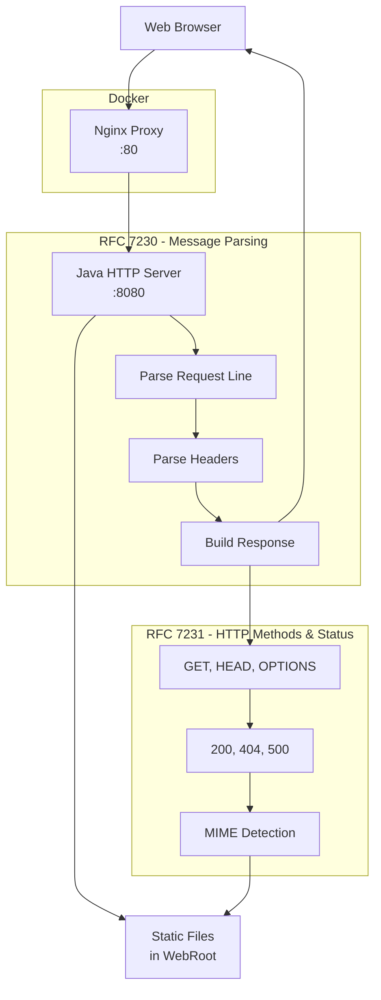

# Java HTTP Server

A custom HTTP/1.1 server implementation built from scratch in Java, featuring Docker containerization, Nginx reverse proxy, and static file serving capabilities.

## 🚀 How to Run This Project

### Local Development

```bash
# Compile and run locally
mvn compile
mvn exec:java

# Or using Maven Wrapper
./mvnw compile
./mvnw exec:java
```

### Docker Deployment

```bash
# Build and start with Docker Compose
docker-compose up --build

# Start in background
docker-compose up -d

# View logs
docker-compose logs -f httpserver

# Stop services
docker-compose down
```

## 🏗️ Architecture & RFC Implementation



### 📋 RFC Implementation Details

**RFC 7230 - Message Syntax & Routing:**

- **Request Line Parsing** → `Method SP Request-Target SP HTTP-Version CRLF`
- **Header Field Parsing** → `field-name ":" OWS field-value OWS`
- **Message Body Handling** → Content separated by CRLF
- **HTTP/1.1 Version Support** → Version validation and response formatting

**RFC 7231 - Semantics & Content:**

- **GET Method** → Retrieve resources (safe, idempotent)
- **HEAD Method** → Like GET but without response body
- **OPTIONS Method** → CORS preflight support
- **Status Codes** → 200 (OK), 404 (Not Found), 500 (Server Error)
- **Content-Type Headers** → Automatic MIME type detection
- **Content-Length** → Proper response body size calculation

## 🐳 Docker Components

- **Java HTTP Server Container**: Custom-built container running the HTTP server
- **Nginx Container**: Reverse proxy for load balancing and SSL termination
- **Docker Compose**: Orchestrates multi-container setup with health checks
- **Maven Wrapper**: Ensures consistent Maven version across environments

## 🔧 Features

- **HTTP/1.1 Protocol Implementation**
- **Static File Serving** (HTML, CSS, images)
- **MIME Type Detection**
- **CORS Support**
- **Docker Containerization**
- **Nginx Reverse Proxy**
- **Health Checks & Monitoring**
- **Multi-stage Docker Builds**

## 🌐 Access Points

- **Direct Java Server**: http://localhost:8080/
- **Through Nginx Proxy**: http://localhost/
- **Health Check**: http://localhost/health

## HTTP/1.1 Message Structure & RFC References

When building an HTTP server, it's important to understand the structure and semantics defined by the HTTP/1.1 specifications.

---

### 📜 RFC Overview

- **RFC 7230** – *Message Syntax and Routing*: Defines HTTP message format (start-line, headers, body).
- **RFC 7231** – *Semantics and Content*: Defines HTTP methods, status codes, and request/response semantics.
- **RFC 7232** – *Conditional Requests*: Defines caching-related headers (`If-Modified-Since`, `ETag`, etc.).

### 🔗 RFC References

- [RFC 7230: HTTP/1.1 Message Syntax and Routing](https://datatracker.ietf.org/doc/html/rfc7230)
- [RFC 7231: HTTP/1.1 Semantics and Content](https://datatracker.ietf.org/doc/html/rfc7231)
- [RFC 7232: HTTP/1.1 Conditional Requests](https://datatracker.ietf.org/doc/html/rfc7232)


---

### 📨 HTTP Message Structure (RFC 7230)


- **Start-Line** → Request Line *(for requests)* or Status Line *(for responses)*
- **Header Fields** → Metadata (`Host`, `Content-Type`, etc.)
- **CRLF** → Empty line separating headers and body
- **Message Body** → Optional content (HTML, JSON, binary, etc.)

---

### 📥 HTTP Request Line & Methods (RFC 7231)


**Methods Defined in RFC 7231:**

- `GET` → Retrieve resource (safe, idempotent)
- `HEAD` → Like GET, but without body
- `POST` → Submit data to server
- `PUT` → Create/replace resource
- `DELETE` → Remove resource
- `CONNECT` → Establish a tunnel
- `OPTIONS` → Query communication options
- `TRACE` → Diagnostic echo of request

---

## 🛠️ Development Tools

### Maven Wrapper

The project includes Maven Wrapper (`mvnw`) to ensure consistent builds:

- **Windows**: `mvnw.cmd compile`
- **Unix/Mac**: `./mvnw compile`

### Docker Commands

```bash
# Build only
docker-compose build

# View running containers
docker-compose ps

# Execute shell in container
docker-compose exec httpserver bash

# View Nginx logs
docker-compose logs nginx
```

### 🔗 Quick Notes

- **Message structure** → RFC 7230  
- **Method definitions** → RFC 7231  
- **Conditional headers** → RFC 7232
- **Docker networking** → Internal container communication
- **Nginx proxy** → Load balancing and SSL-ready
